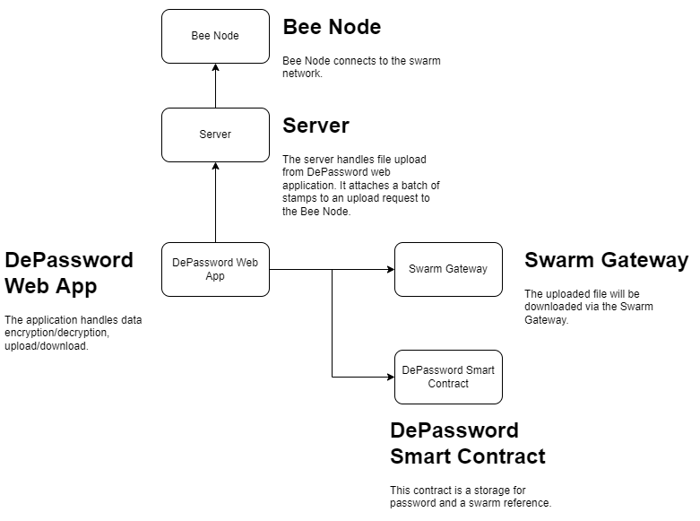

# DePassword
A decentrailzed password and file management. Only users have control over the data that being encrypted in Swarm and a smart contract.

## Architecture
<div width="100%">
  
</div>

## Demo Video
- https://youtu.be/gEn3SxuLy4E
- [](https://www.youtube.com/watch?v=gEn3SxuLy4E)

## Demo Link
Note that the demo is running on Rinkeby testnet for the smart contract, and Goerli testnet for the Bee node. Please change your network to "Rinkeby" before using the app.

- BZZ Link: https://bah5acgzapwqvde6ydrsvl65bfpt7vjzhfsts22u7lydxrtcbqdjr5poi76aa.bzz.link/
- BZZ Link with ENS Name: https://synycboom.bzz.link (Actually, we set it to https://depassword.synycboom.bzz.link but there is a SSL certification problem)

## Deploy smart contracts on rinkeby network
```
$ cd contracts
$ npx hardhat compile
$ npm run rinkeby:deploy-v1
```
Deployed DePassword contract on Rinkeby: 0xEaf8FDc9ce9C59162f32d43C4128F648FA46b275

## Running a web application
1. Configure environment variables
```shell
$ cd fe
$ cat .env.example > .env
```
2. If this is the first time, install dependencies
```shell
$ cd fe
$ npm ci
```
3. Run the server
```
$ npm run start
```

## Running a server
1. You need to deploy your bee node. You can follow this guide https://docs.ethswarm.org/docs/installation/quick-start
2. Fund your node and buy a batch of stamps. You'll get a batchID and wait for it to be ready to use.
3. Configure environment variables, set your SWARM_POSTAGE_BATCH_ID and BEE_NODE_URL, and other variables.
```shell
$ cd server
$ cat .env.example > .env
```
4. If this is the first time, install dependencies
```shell
$ cd server
$ npm ci
```
5. Run the server
```
$ npm run build
$ npm run start
```
